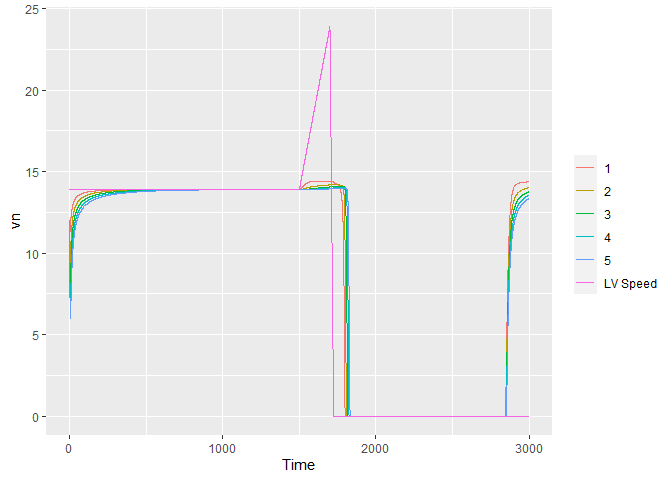
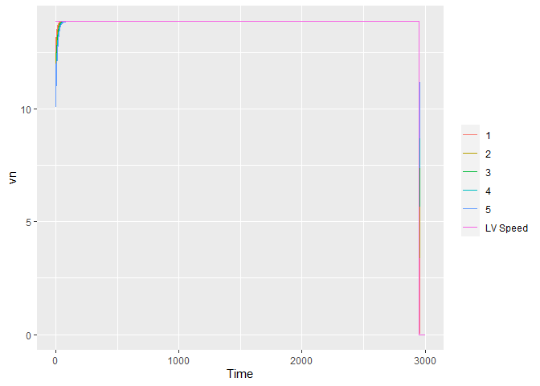
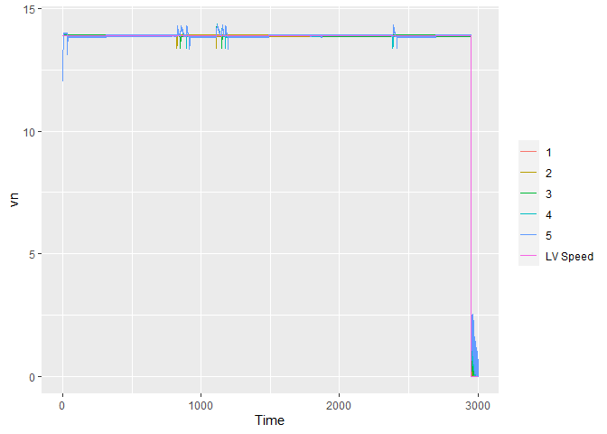
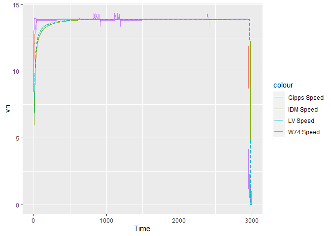
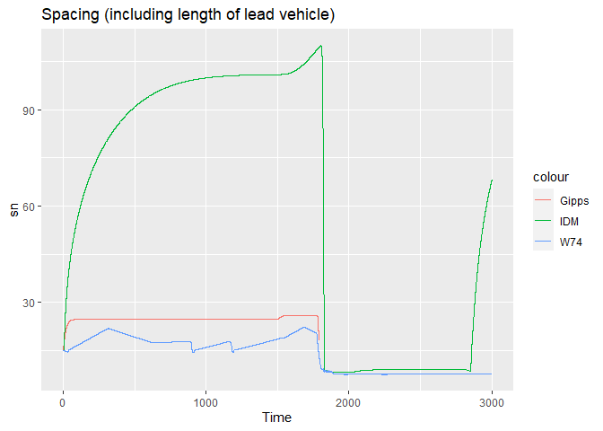

<!-- README.md is generated from README.Rmd. Please edit that file -->

# carfollowingmodels

<!-- badges: start -->
<!-- badges: end -->

The goal of `carfollowingmodels` is to make several car following models
available in R for numerical simulation.

## Installation

`carfollowingmodels`is not on CRAN yet. You can download the development
version from GitHub with:

``` r
# install.packages("devtools")
devtools::install_github("durraniu/carfollowingmodels")
```

## Example

To use any car-following model, you need to provide the lead vehicle
data, initial position, speed and/or acceleration of following
vehicle(s), and model parameters.

The models used in this package are cited below:

| Model                    | Citation                                                     |
|--------------------------|--------------------------------------------------------------|
| Intelligent Driver Model | Treiber and Arne Kesting (2013)                              |
| Gipps Model              | Gipps (1981)                                                 |
| Wiedemann 74 Model       | Wiedemann and Reiter (1992); Higgs, Abbas, and Medina (2011) |

Following shows an example with 5 following vehicles. The lead vehicle
is moving at 13.9 m/s at the reference position of 100 m.

``` r
# Time
last_time <- 3000 ## s
time_frame <- 0.1 ## s
Time <- seq(from = 0, to = last_time, by = time_frame)
time_length <- length(Time)


## Lead vehicle
vn1_first <- 13.9 ## first speed m/s
xn1_first <- 100 ## position of lead vehicle front center m
bn1_complete <- c(rep(0, 15000),
                  rep(0.05, 2000),
                  rep(-1, 3000),
                  rep(0, 8000),
                  rep(-5, 2001))


#############################################
### Complete speed trajectory of Lead vehicle
#############################################

vn1_complete <- rep(NA_real_, time_length) ### an empty vector
xn1_complete <- rep(NA_real_, time_length) ### an empty vector

vn1_complete[1] <- vn1_first
xn1_complete[1] <- xn1_first

for (t in 2:time_length) {

 ### Lead vehicle calculations
 vn1_complete[t] <- vn1_complete[t-1] + (bn1_complete[t-1] * time_frame)

 vn1_complete[t] <- ifelse(vn1_complete[t] < 0, 0, vn1_complete[t])


 xn1_complete[t] <- xn1_complete[t-1] + (vn1_complete[t-1] * time_frame) +
  (0.5 * bn1_complete[t-1] * (time_frame)^2)

}

## Lead vehicle data in a dataframe
ldf <- data.frame(Time, bn1_complete, xn1_complete, vn1_complete)
```

## Intelligent Driver Model (IDM)

To predict the trajectories of the 5 following vehicles, you can use any
car-following model available in this package. For example, the
`simulate_idm()` function uses the Intelligent Driver Model as shown
below. For more details on input arguments, type `?simulate_idm`in the
console.

``` r
library(carfollowingmodels)

## Run the IDM function:
results_idm <- simulate_idm(

resolution=0.1,
N=5,

dfn1=ldf,
xn1="xn1_complete",
vn1="vn1_complete",

xn_first=list(85, 70, 55, 40, 25),
vn_first=list(12, 12, 12, 12, 12),
ln=list(5, 5, 5, 5, 5),

a=2,
v_0=14.4,
small_delta=1,
s_0=4,
Tg=1,
b=1.5
)


head(results_idm)
#>   fvn Time    xn1  vn1 ln1         bn       xn       vn       sn    deltav
#> 1   1  0.0 100.00 13.9   5 -1.4407191 85.00000 12.00000 15.00000 -1.900000
#> 2   1  0.1 101.39 13.9   5 -1.1565350 86.19280 11.85593 15.19720 -2.044072
#> 3   1  0.2 102.78 13.9   5 -0.9399018 87.37261 11.74027 15.40739 -2.159725
#> 4   1  0.3 104.17 13.9   5 -0.7704464 88.54193 11.64628 15.62807 -2.253716
#> 5   1  0.4 105.56 13.9   5 -0.6351232 89.70271 11.56924 15.85729 -2.330760
#> 6   1  0.5 106.95 13.9   5 -0.5252076 90.85646 11.50573 16.09354 -2.394273
#>    sn_star
#> 1 9.418207
#> 2 8.860068
#> 3 8.420694
#> 4 8.069309
#> 5 7.785079
#> 6 7.553349
```

Now you can plot the results:

``` r
library(tidyverse)
#> Warning: package 'tidyverse' was built under R version 4.0.4
#> -- Attaching packages --------------------------------------- tidyverse 1.3.0 --
#> v ggplot2 3.3.3     v purrr   0.3.4
#> v tibble  3.1.1     v dplyr   1.0.5
#> v tidyr   1.1.3     v stringr 1.4.0
#> v readr   1.4.0     v forcats 0.5.1
#> Warning: package 'tibble' was built under R version 4.0.5
#> Warning: package 'tidyr' was built under R version 4.0.5
#> Warning: package 'dplyr' was built under R version 4.0.5
#> -- Conflicts ------------------------------------------ tidyverse_conflicts() --
#> x dplyr::filter() masks stats::filter()
#> x dplyr::lag()    masks stats::lag()

## Position
results_at_time_0_LV <- subset(results_idm, fvn==1 & Time ==0)
results_at_time_0_FV <- subset(results_idm, Time ==0)

ggplot() +
  geom_rect(data = results_at_time_0_LV,
            aes(xmin = xn1 - ln1,
                xmax = xn1,
                
                ymin = 0.628,
                ymax = 3.028)) +
  geom_rect(data = results_at_time_0_FV,
            aes(group = fvn,
                fill = as.factor(fvn),
                xmin = xn - 5,
                xmax = xn,
                
                ymin = 0.628,
                ymax = 3.028)) +
  geom_hline(yintercept = 3.6, linetype = "longdash") +
  coord_fixed(ratio=1) +
  theme(legend.title = element_blank())
```


``` r

## Speed
ggplot(data = results_idm) +
  geom_line(aes(x = Time, y = vn, color = as.factor(fvn), group=fvn)) +
  geom_line(data = subset(results_idm, fvn==1),
            aes(x = Time, y = vn1, color = "LV Speed")) +
  theme(legend.title = element_blank())
```



## Gipps Model

``` r
results_gipps <- simulate_gipps(


resolution=0.1,  
N=5,

dfn1=ldf, 
xn1="xn1_complete", 
vn1="vn1_complete", 


xn_first=list(85, 70, 55, 40, 25),
vn_first=list(12, 12, 12, 12, 12), 
ln=list(6.5, 6.5, 6.5, 6.5, 6.5),


an=2, 
Vn=14.4, 
tau=0.1, 
bn=-1.5, 
bcap=-2 
)


head(results_gipps)
#>   fvn Time    xn1  vn1 ln1        bn       xn       vn       sn    deltav
#> 1   1  0.0 100.00 13.9 6.5 0.7815591 85.00000 12.00000 15.00000 -1.900000
#> 2   1  0.1 101.39 13.9 6.5 0.7585004 86.20391 12.07816 15.18609 -1.821844
#> 3   1  0.2 102.78 13.9 6.5 0.7359608 87.41552 12.15401 15.36448 -1.745994
#> 4   1  0.3 104.17 13.9 6.5 0.7139400 88.63460 12.22760 15.53540 -1.672398
#> 5   1  0.4 105.56 13.9 6.5 0.6924367 89.86093 12.29900 15.69907 -1.601004
#> 6   1  0.5 106.95 13.9 6.5 0.6714485 91.09429 12.36824 15.85571 -1.531760


## Speed
ggplot(data = results_gipps) +
  geom_line(aes(x = Time, y = vn, color = as.factor(fvn), group=fvn)) +
  geom_line(data = subset(results_gipps, fvn==1),
            aes(x = Time, y = vn1, color = "LV Speed")) +
  theme(legend.title = element_blank())
#> Warning: Removed 60560 row(s) containing missing values (geom_path).
```



## Wiedemann 74 Model (individual driver)

``` r
results_w74d <- simulate_wiedemann74_driver(
 resolution=0.1,
 N=5,
 dfn1=ldf,
 xn1="xn1_complete",
 vn1="vn1_complete",
 bn1="bn1_complete",
 xn_first=list(85, 70, 55, 40, 25),
 vn_first=list(12, 12, 12, 12, 12),
 ln=list(5, 5, 5, 5, 5),
 D_MAX=150,
 V_MAX=44,
 V_DESIRED=14.4,
 FAKTORVmult=0.001,
 BMAXmult=0.08,
 BNULLmult=0.25,
 BMIN=-5,
 CX=50,
 AXadd=2,
 BXadd=2,
 EXadd=2,
 OPDVadd=1.5
)


head(results_w74d)
#>   fvn Time    xn1  vn1 ln1        bn       xn       vn       sn    deltav AX
#> 1   1  0.0 100.00 13.9   5 0.5926839 85.00000 12.00000 15.00000 -1.900000  7
#> 2   1  0.1 101.39 13.9   5 0.5782258 86.20296 12.05927 15.18704 -1.840732  7
#> 3   1  0.2 102.78 13.9   5 0.5641204 87.41178 12.11709 15.36822 -1.782909  7
#> 4   1  0.3 104.17 13.9   5 0.5503591 88.62631 12.17350 15.54369 -1.726497  7
#> 5   1  0.4 105.56 13.9   5 0.5369335 89.84641 12.22854 15.71359 -1.671461  7
#> 6   1  0.5 106.95 13.9   5 0.5238353 91.07195 12.28223 15.87805 -1.617768  7
#>         BX      ABX CX      SDX        SDV      CLDV       OPDV      BMAX B_App
#> 1 6.928203 13.92820 50 20.85641 0.02560000 0.1024000 -0.1536000 0.5926839    NA
#> 2 6.945291 13.94529 50 20.89058 0.02681103 0.1072441 -0.1608662 0.5782258    NA
#> 3 6.961922 13.96192 50 20.92384 0.02801083 0.1120433 -0.1680650 0.5641204    NA
#> 4 6.978109 13.97811 50 20.95622 0.02919785 0.1167914 -0.1751871 0.5503591    NA
#> 5 6.993866 13.99387 50 20.98773 0.03037064 0.1214826 -0.1822238 0.5369335    NA
#> 6 7.009203 14.00920 50 21.01841 0.03152790 0.1261116 -0.1891674 0.5238353    NA
#>   B_Emg BNULL cf_state_sim
#> 1    NA  0.25 free_driving
#> 2    NA  0.25 free_driving
#> 3    NA  0.25 free_driving
#> 4    NA  0.25 free_driving
#> 5    NA  0.25 free_driving
#> 6    NA  0.25 free_driving


## Speed
ggplot(data = results_w74d) +
  geom_line(aes(x = Time, y = vn, color = as.factor(fvn), group=fvn)) +
  geom_line(data = subset(results_w74d, fvn==1),
            aes(x = Time, y = vn1, color = "LV Speed")) +
  theme(legend.title = element_blank())
```



### Outputs

| Variable       | Description                                                                                                                                   | Model       |
|----------------|-----------------------------------------------------------------------------------------------------------------------------------------------|-------------|
| fvn            | Following vehicle number                                                                                                                      | Common      |
| Time           | Time in seconds                                                                                                                               | Common      |
| xn1            | Position of front center of the lead vehicle                                                                                                  | Common      |
| vn1            | Speed of the lead vehicle                                                                                                                     | Common      |
| ln1            | Length of the lead vehicle                                                                                                                    | Common      |
| bn             | Acceleration (positive and negative) of the following vehicle                                                                                 | Common      |
| xn             | Position of front center of the following vehicle                                                                                             | Common      |
| vn             | Speed of the following vehicle                                                                                                                | Common      |
| sn             | Spacing between the front bumper of the following vehicle and the front bumper of the lead vehicle (including the length of the lead vehicle) | Common      |
| deltav         | Speed difference (following vehicle speed - lead vehicle speed)                                                                               | Common      |
| sn\_star       | Desired spacing                                                                                                                               | IDM         |
| AX             | Standstill spacing                                                                                                                            | Wiedemann74 |
| BX             | Calibration Parameter                                                                                                                         | Wiedemann74 |
| ABX            | Minimum following distance                                                                                                                    | Wiedemann74 |
| CX             | Calibration Parameter                                                                                                                         | Wiedemann74 |
| SDX            | Minimum following distance + drift due to unequal speed difference in opening and closing                                                     | Wiedemann74 |
| SDV            | Speed difference when driver perceives approaching a slow lead vehicle                                                                        | Wiedemann74 |
| CLDV           | Speed difference when driver perceives closing in to lead vehicle                                                                             | Wiedemann74 |
| OPDV           | Speed difference when driver perceives losing lead vehicle                                                                                    | Wiedemann74 |
| BMAX           | Acceleration in Free-driving                                                                                                                  | Wiedemann74 |
| B\_App         | Deceleration in Approaching                                                                                                                   | Wiedemann74 |
| B\_Emg         | Deceleration in Emergency-braking                                                                                                             | Wiedemann74 |
| BNULL          | Acceleration (positive and negative) in Following and at desired speed in Free-driving                                                        | Wiedemann74 |
| cf\_state\_sim | Driving state (Free-driving, Approaching, Following, Emergency-braking)                                                                       | Wiedemann74 |

### Compare Models

Comparing models is difficult as each model has at least a few unique
parameters of its own. Nevertheless, following shows the speed of the
fifth following vehicle as predicted by different models:

``` r
results_gipps_fv1 <- results_gipps %>% 
  filter(fvn == 5)

results_idm_fv1 <- results_idm %>% 
  filter(fvn == 5)

results_w74d_fv1 <- results_w74d %>% 
  filter(fvn == 5)

ggplot() +
  geom_line(data = results_gipps_fv1 ,
            aes(x = Time, y = vn, color = "Gipps Speed")) +
  geom_line(data = results_idm_fv1 ,
            aes(x = Time, y = vn, color = "IDM Speed")) +
  geom_line(data = results_w74d_fv1 ,
            aes(x = Time, y = vn, color = "W74 Speed")) +
  geom_line(data = ldf ,
            aes(x = Time, y = vn1_complete, color = "LV Speed"), linetype = "longdash") +
  ggtitle("Speed")
#> Warning: Removed 12110 row(s) containing missing values (geom_path).
```



``` r

ggplot() +
  geom_line(data = results_gipps_fv1 ,
            aes(x = Time, y = sn, color = "Gipps")) +
  geom_line(data = results_idm_fv1 ,
            aes(x = Time, y = sn+ln1, color = "IDM")) +
  geom_line(data = results_w74d_fv1 ,
            aes(x = Time, y = sn, color = "W74")) +
  ggtitle("Spacing (including length of lead vehicle)")
#> Warning: Removed 12111 row(s) containing missing values (geom_path).
```



# References

<div id="refs" class="references csl-bib-body hanging-indent">

<div id="ref-Gipps1981" class="csl-entry">

Gipps, P G. 1981. “<span class="nocase">A behavioural car following
model for computer simulation</span>.” *Transportation Research Part B*
15: 101–15.

</div>

<div id="ref-Higgs2011" class="csl-entry">

Higgs, Bryan, MM Abbas, and Alejandra Medina. 2011. “<span
class="nocase">Analysis of the Wiedemann Car Following Model over
Different Speeds using Naturalistic Data</span>.” *3rd International
Conference on Road Safety and Simulation*, 1–22.

</div>

<div id="ref-Treiber2013" class="csl-entry">

Treiber, Martin, and Arne Kesting. 2013. “<span class="nocase">Traffic
flow dynamics</span>.” *Traffic Flow Dynamics: Data, Models and
Simulation, Springer-Verlag Berlin Heidelberg*.

</div>

<div id="ref-Wiedemann1992" class="csl-entry">

Wiedemann, Reiter, and U Reiter. 1992. “<span class="nocase">Microscopic
traffic simulation: the simulation system MISSION, background and actual
state</span>.” *Project ICARUS (V1052) Final Report. Brussels, CEC* 2:
1–53.

</div>

</div>
